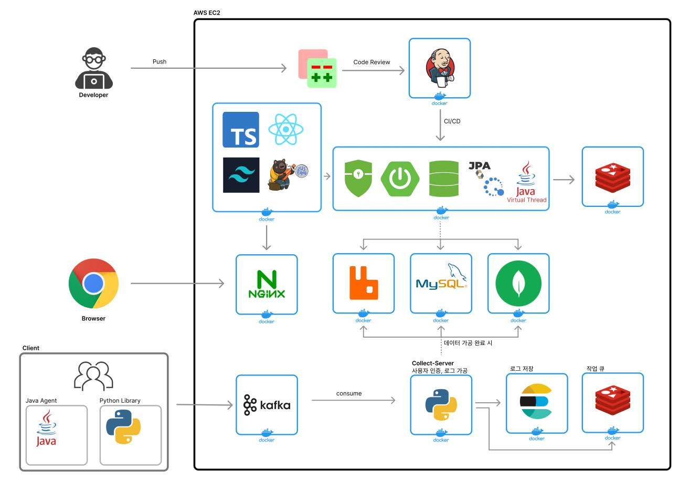
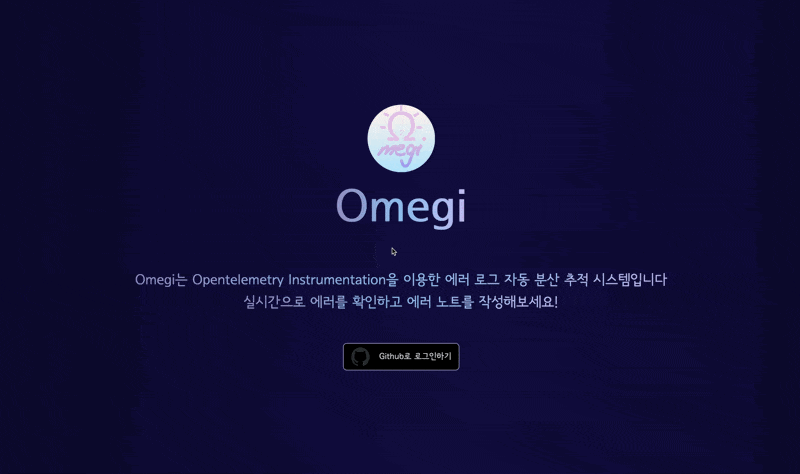
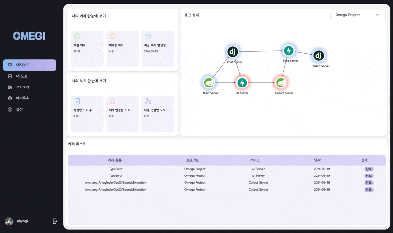
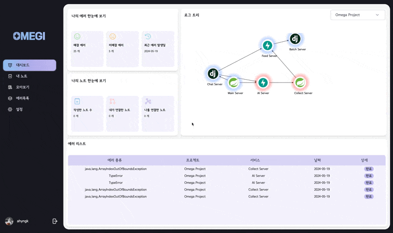
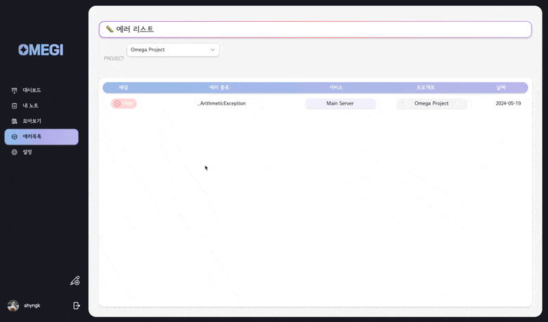
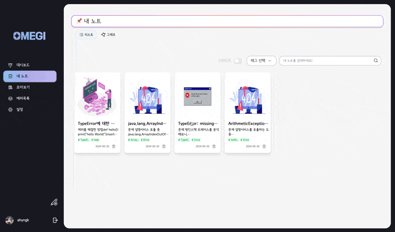
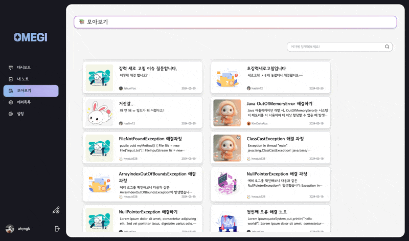
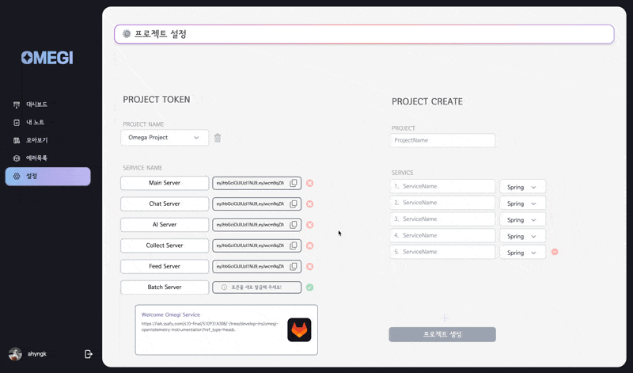

# Omegi 오류 추적과 오류 노트를 하나로

&nbsp;

## 💡 프로젝트 소개

> 오메기는 분산시스템에서 오류를 자동으로 추적 및 분석하며 오류를 기반으로 해결 과정을 노트로 남길 수 있는 서비스입니다

- 개발 기간: 2024.04.08 ~ 2024.05.20(약 7주)
- 팀원

| BE     | BE     | BE     | BE     | FE     | FE     |
| ------ | ------ | ------ | ------ | ------ | ------ |
| 유제훈 | 오화석 | 김아영 | 김도하 | 손민기 | 고해림 |

&nbsp;

## 🛠 아키텍쳐

## ✨ 기능 소개

&nbsp;

### 메인 화면

- 서비스에 대한 간략한 소개를 볼 수 있으며, GitHub를 통한 로그인 기능을 제공합니다

&nbsp;

### 대시보드

#### 서비스 한눈에 보기 & SSE를 통한 에러 발생 알림

- 사용자의 서비스를 프로젝트별로 한 눈에 확인할 수 있는 대시보드를 제공합니다.
- 에러 발생 현황 및 현재까지 발생한 에러의 통계, 노트 통계를 함께 제공합니다.
- SSE를 통한 실시간 알림 기능을 제공하여 사용자의 서비스에서 에러 발생 시 알림이 표시됩니다.

#### 에러 해결 완료

- 대시보드 에러 리스트의 에러는 해결 여부를 사용자가 선택할 수 있습니다.
- 해결되지 않은 에러는 서비스 흐름도에서 붉은 색으로 하이라이트 되며, 에러 해결 완료 시 기본 파란 색으로 변경됩니다.

#### 네비게이션 바를 통한 에러 발생 알림

- 사용자가 대시보드 이외의 페이지에 접속해 있을 경우, 네비게이션 바를 통해 에러 발생 여부를 확인할 수 있습니다.
- SSE를 통한 에러 알림은 네비게이션 바의 대시보드 아이콘의 빨간 점을 통해 사용자에게 전달됩니다.

&nbsp;

### 에러 리스트 및 에러 상세 페이지

#### 에러 리스트

- 사용자의 서비스에서 발생한 에러는 프로젝트 단위로 리스트 형식을 통해 확인할 수 있습니다.
- 에러 리스트에는 발생한 에러 종류, 서비스, 프로젝트, 발생 시각의 정보가 함께 표시됩니다.

#### 에러 상세 조회

- 에러 리스트에서는 클릭 이벤트를 통해 에러 하나의 상세 정보를 조회할 수 있습니다.
- 에러 상세 페이지는 한 에러가 발생하기까지의 서비스 간 흐름을 보여주는 Trace, 에러 요약인 Summary, 에러 원문인 Log로 구성됩니다.
- 사용자는 본인의 서비스에서 발생한 에러에 대한 원인과 흐름을 명확하게 파악할 수 있습니다.

&nbsp;

### 노트

#### 노트 조회 및 그래프

- 사용자는 에러 노트, 일반 노트 두 가지 종류의 노트를 작성할 수 있습니다.
- 본인이 작성한 노트의 경우 리스트, 그래프 두 가지 형식의 보기가 제공됩니다.
- 그래프 뷰에서는 사용자가 작성한 노트 및 연결한 다른 노트, 노트의 태그가 그래프와 간선 형태로 시각화 되어 표시됩니다.

#### 노트 작성 에디터

- 사용자의 노트 작성을 위해 MarkDown 형식의 에디터를 지원합니다.
- 사용자는 익숙한 MarkDown 문법을 이용해 자유롭게 노트를 작성하고 저장할 수 있습니다.

#### 노트 연결

- 사용자는 본인의 노트, 다른 사용자들의 노트와 본인이 작성한 노트를 연결할 수 있습니다.
- 노트 하단에는 연결 된 노트의 개수가 표현되며, 연결된 노트의 경우 그래프 뷰에서 간선으로 표시됩니다.

&nbsp;

### 설정

#### 프로젝트 등록 및 토큰 발급

- 사용자는 오류 추적 기능을 활성화 하기 위해 설정 페이지에서 프로젝트 및 서비스 등록을 진행할 수 있습니다.
- 프로젝트와 서비스를 등록한 뒤, 서비스 별로 토큰을 발급받아 오류 추적 데이터 전송 시 인증을 진행하는 방식으로 구현되어 있습니다.

#### 프로젝트 설정 가이드

- 사용자의 서비스에 본 서비스의 오류 추적 기능 도입을 위한 가이드를 제공합니다.
- Java, Python 두 가지 언어로 제공되는 Agent는 각각 Readme를 통한 사용 설명서가 제공되고 있습니다.

&nbsp;

## 💻 기술 소개

### 에러 추적

본 서비스의 주요 기능 중 하나인 에러 추적은 사용자의 서비스의 정상 흐름 및 에러 발생을 추적할 수 있으며, 서비스가 분리되어 있는 msa 구조에서 서비스 사이의 흐름까지도 파악할 수 있도록 하는 것이 주요 목적입니다.  
이러한 기능을 구현하기 위해 하나의 요청 단위를 기록하는 Trace, Trace 내부의 각 단계들을 기록하는 Span 을 사용하는 오픈텔레메트리 오픈 소스 프로젝트를 확장하는 방식을 채택하였습니다.

저희 서비스의 오류 추적은 오픈텔레메트리 프로젝트를 기반으로 3가지 커스텀 포인트를 통해 기능을 확장하였습니다.

1. 서비스 간 동일한 Trace 전파를 위해 사용되는 Propagator

- python 과 java 서버 사이의 흐름 전파를 위해 각 언어에 동일한 Propagator 를 구성하였습니다
- 동일한 traceId 출력을 위해 추가적인 인코딩 설정을 적용하였습니다

2. 추적 로그를 Kafka 또는 콘솔로 내보낼 수 있도록 Exporter 생성

- 사용자는 환경변수 설정을 통해 Exporter를 지정할 수 있습니다
- 로그 데이터 전송 안전성을 위하 Kafka Exporter와 빠른 확인을 위한 ConsoleExporter를 지원합니다

3. 계측의 범위 확장

- 오픈텔레메트리는 기본적으로 Http Request, DB 연결 등 서비스 Edge에 대한 Span 을 제공합니다
- 저희는 이를 확장하여 메서드 단위로 Span을 생성하여 요청의 흐름을 보다 자세히 기록 할 수 있도록 하였습니다
- 자바에서는 바이트 코트를 조작할 수 있는 바이트 버디, 파이썬에서는 함수를 감싸서 실행할 수 있는 데코레이터를 활용하는 방식으로 메서드 단위의 계측을 구현하였습니다

이러한 기능을 사용자가 서비스에 적용할 때, 코드의 수정 없이 편리하게 사용할 수 있도록 에이전트로 제공하고 있습니다.  
에이전트는 현재 자바, 파이썬 두 가지 언어를 지원하며 jar 파일과 pypi 라이브러리로 제공됩니다.

&nbsp;

### 에러 가공

추적된 데이터는 각 서비스에서 Trace 단위로 저희 서버의 Kafka로 전송됩니다.

전송된 데이터는 Redis 작업 큐와 Elasticsearch 저장소를 활용하여 한 Trace에 대한 모든 데이터가 도착할 때까지 저장하고 대기하며, 데이터가 모두 확보될 시 하나의 에러 데이터로 가공하여 MySql과 MongoDb 에 저장됩니다.

사용자가 본인의 서비스에서 발생한 에러에 대해 파악하기 용이하도록 메서드 단위의 흐름, 에러타입, 에러 본문을 포함하는 형식으로 가공하고 있습니다.

&nbsp;

## ⚙ 프로젝트 구조

### 기술 스택

| 분류  | 기술 |
| ----- | ---------------------------------------------------------------------------------------------------------------------------------------------------------------------------------------------------------------------------------------------------------------------------------------------------------------------------------------------------------------------------------------------------------------- |
| BE    |                                                                                                                  |
| FE    |     |
| DB    |                                                                                                                                                                                                                       |
| Infra |                                                                                                                  |
